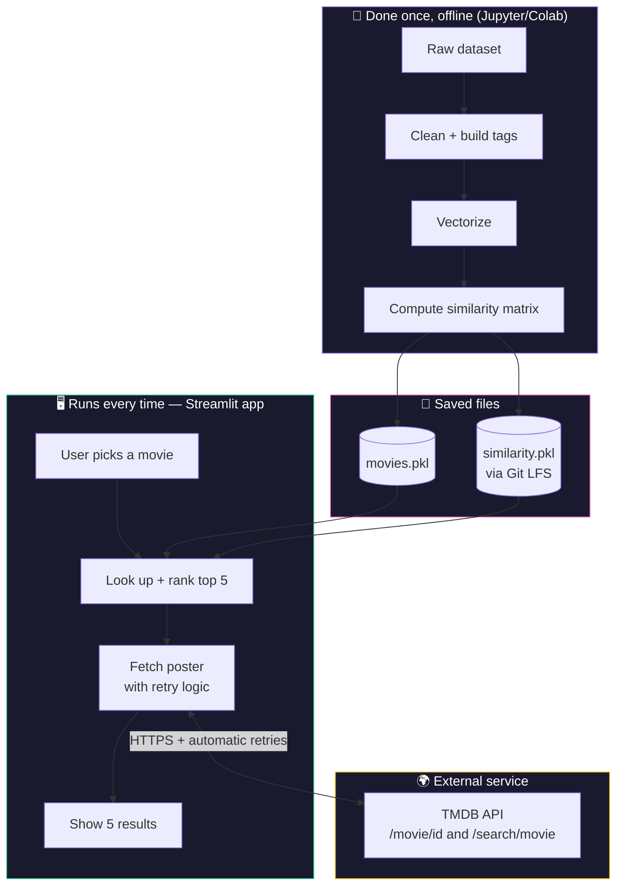

<div align="center">


<br/>


</div>

<br/>

## 🎯 What this actually does

You pick a movie. In a couple of seconds, the app shows you **5 similar movies with real posters** — no login, no ratings required, no "people also watched" tracking.

How it decides what's "similar": it looks at each movie's **genre, cast, director, and plot keywords**, turns that into numbers, and finds the 5 movies whose numbers are closest to the one you picked. This approach is called **content-based filtering** — it works from day one, even for a brand-new or obscure movie, because it never needs anyone's viewing history to function.

<br/>

<table>
<tr>
<td width="50%" valign="top">

### ✅ What you get
- Search any movie from a 5000-movie dataset
- 5 instant recommendations, ranked by similarity
- Real posters fetched live from TMDB
- Clean, dark, Netflix-style interface

</td>
<td width="50%" valign="top">

### 🧠 Why this approach
- No "cold start" problem — works on day one
- No login or user data needed
- Fully explainable — you can see *why* two movies matched
- Lightweight enough to run as one simple script

</td>
</tr>
</table>

<br/>

---

<br/>

## ⚙️ How a recommendation happens, step by step

This is what happens in the moment you click "Recommend":

<table>
<tr>
<td width="20%" align="center">

**1**
<br/>
🎯
<br/>
**You pick a movie**
<br/>
<sub>from the search bar</sub>

</td>
<td width="20%" align="center">

**2**
<br/>
🔍
<br/>
**App finds its score row**
<br/>
<sub>in a precomputed similarity table</sub>

</td>
<td width="20%" align="center">

**3**
<br/>
📐
<br/>
**Top 5 scores selected**
<br/>
<sub>out of ~5000 comparisons</sub>

</td>
<td width="20%" align="center">

**4**
<br/>
🌐
<br/>
**Posters fetched live**
<br/>
<sub>one API call per movie, via TMDB</sub>

</td>
<td width="20%" align="center">

**5**
<br/>
🎞️
<br/>
**Results shown**
<br/>
<sub>5 posters + titles, done</sub>

</td>
</tr>
</table>

<br/>

## 🧪 How the matching actually works (the part before the app even runs)

Before any of the above can happen, there's a one-time setup phase — done once, offline, in a notebook — that builds the "similarity scores" the app uses later:

```mermaid
flowchart LR
    A[📂 TMDB 5000 dataset<br/>movies + credits] --> B[🧹 Clean & merge<br/>into one table]
    B --> C[🏷️ Build a 'tags' field<br/>genre + cast + crew + plot]
    C --> D[🔢 Convert text to numbers<br/>CountVectorizer]
    D --> E[📐 Compare every pair<br/>cosine similarity]
    E --> F[💾 Save the results<br/>movies.pkl + similarity.pkl]

    style A fill:#2b2b3d,stroke:#a78bfa,color:#fff
    style B fill:#2b2b3d,stroke:#a78bfa,color:#fff
    style C fill:#1e3a5f,stroke:#60a5fa,color:#fff
    style D fill:#1e3a5f,stroke:#60a5fa,color:#fff
    style E fill:#3d2645,stroke:#f472b6,color:#fff
    style F fill:#1e4d3a,stroke:#34d399,color:#fff
```



**In plain terms:**

| Step | What's happening |
|---|---|
| 📂 Load the data | The Kaggle TMDB 5000 dataset (`movies.csv` + `credits.csv`) is read in |
| 🧹 Clean & merge | Duplicate and missing entries removed; both files joined into one table by movie ID |
| 🏷️ Build tags | For every movie, genres + top cast + director + keywords + plot overview get combined into one text field |
| 🔢 Vectorize | That text is converted into numeric vectors using `CountVectorizer` (5000 most common words, English stopwords removed) |
| 📐 Compare | `cosine_similarity()` measures how close every movie's vector is to every other movie's — producing one big score table |
| 💾 Save | The cleaned data and the full score table are saved to disk (`movies.pkl`, `similarity.pkl`) — this is what the live app loads instantly, instead of recalculating from scratch every time |

> 💡 **Why this matters:** computing similarity for 5000 movies against each other is slow. Doing it once and saving the result means the live app can answer in under a second instead of recalculating everything on every search.

<br/>

## 🏗️ System architecture

Putting it all together — what runs once offline, what's stored, and what runs live every time someone uses the app:



> 💡 The similarity table for 5000 movies is about **176 MB** — too large for a normal GitHub upload (100 MB limit), so it's stored using **Git LFS** instead of a regular file.

<br/>

---

<br/>

## 🧰 Tech stack — what each piece is responsible for

| Tool | What it's doing here |
|---|---|
| 🐍 **Python** | The language everything is written in |
| 🖥️ **Streamlit** | Builds the web interface — the search box, buttons, and poster grid |
| 🧮 **Pandas / NumPy** | Loads and organizes the 5000-movie dataset |
| 🧠 **scikit-learn** | Does the actual similarity math (`CountVectorizer` + `cosine_similarity`) |
| 📡 **TMDB API** | Supplies the real movie posters, fetched live when you search |
| 🔁 **requests + urllib3 Retry** | Automatically retries a poster request if the network call fails |
| 🗄️ **pickle + Git LFS** | Stores the precomputed data so the app doesn't recalculate everything from scratch |

<br/>

## 🔑 Before you run this: you need your own free API key

> [!IMPORTANT]
> **Posters will not load without this step.** The app fetches movie posters live from TMDB, which requires a personal API key. No key is included in this repository — for security, each person who runs the project needs their own.

**Getting one is free and takes under 2 minutes:**

1. Create a free account at [themoviedb.org](https://www.themoviedb.org/signup)
2. Go to **Settings → API** → [themoviedb.org/settings/api](https://www.themoviedb.org/settings/api)
3. Click **Create**, select **Developer**, fill in the short form (any project name works for personal use)
4. Copy your **API Key (v3 auth)**

Then save it somewhere your code can read it, but that never gets uploaded to GitHub:

```bash
mkdir .streamlit
```

Create a file named `.streamlit/secrets.toml` with this content:
```toml
TMDB_API_KEY = "paste_your_real_key_here"
```

> [!NOTE]
> This file is already listed in `.gitignore`, so it will never be pushed to GitHub. Each person who clones this project adds their own key the same way.

<br/>

## 🚀 Installation & running it locally

```bash
# 1. Clone the project (Git LFS is required — similarity.pkl is a large file)
git lfs install
git clone https://github.com/Itsshraddha/Movie-Recommendation-System.git
cd Movie-Recommendation-System

# 2. Create a virtual environment (recommended)
python -m venv venv
source venv/bin/activate      # On Windows: venv\Scripts\activate

# 3. Install required packages
pip install -r requirements.txt

# 4. Add your TMDB API key — see the section above

# 5. Run the app
streamlit run app.py
```

The app opens automatically at `http://localhost:8501` 🎬

<br/>

---

<br/>

## 📸 Screenshots

<div align="center">

> 📁 Place your 5 screenshots inside an `assets/` folder in the project root, named as below — or update the filenames to match your own.

<table>
<tr>
<td align="center" width="33%">

<br/><sub><b>1️⃣ Home screen</b></sub>
</td>
<td align="center" width="33%">

<br/><sub><b>2️⃣ Searching for a movie</b></sub>
</td>
<td align="center" width="33%">

<br/><sub><b>3️⃣ Recommendations shown</b></sub>
</td>
</tr>
<tr>
<td align="center" width="33%">

<br/><sub><b>4️⃣ Close-up of a result</b></sub>
</td>
<td align="center" width="33%">

<br/><sub><b>5️⃣ Full app view</b></sub>
</td>
<td width="33%"></td>
</tr>
</table>

</div>

<br/>

## 📂 Project structure

```
Movie-Recommendation-System/
│
├── app.py                  # Main application — UI + recommendation logic
├── movies.pkl              # Cleaned movie metadata
├── similarity.pkl          # Precomputed similarity scores (via Git LFS)
├── requirements.txt        # Python dependencies
├── .gitattributes          # Git LFS tracking configuration
├── .gitignore              # Keeps your API key out of the public repo
├── .streamlit/
│   └── secrets.toml        # 🔒 Your personal TMDB API key (never committed)
└── README.md                # This file
```

<br/>

## 🗺️ Roadmap

- [x] Content-based recommendation engine using cosine similarity
- [x] Dark-themed Streamlit interface
- [x] Live poster fetching with automatic retries and name-search fallback
- [x] Git LFS support for the large similarity file
- [ ] Deploy publicly on Streamlit Community Cloud
- [ ] Add genre and release-year filters
- [ ] Combine with collaborative filtering for a hybrid model
- [ ] Show trailer previews on hover
- [ ] Add caching to reduce repeated TMDB API calls

<br/>

## 🤝 Contributing

Contributions and suggestions are welcome.

```bash
git checkout -b feature/your-idea
git commit -m "Add: your idea"
git push origin feature/your-idea
```

Then open a pull request describing the change.

<br/>

## 📜 License & credits

**License:** MIT — free to use, modify, and share.

**Built using:**
- [TMDB](https://www.themoviedb.org/) — movie data and posters
- [Kaggle TMDB 5000 dataset](https://www.kaggle.com/datasets/tmdb/tmdb-movie-metadata) — the underlying dataset
- [Streamlit](https://streamlit.io/) — for the web interface

<br/>

<div align="center">

### ⭐ If this helped you, consider starring the repo


</div>
